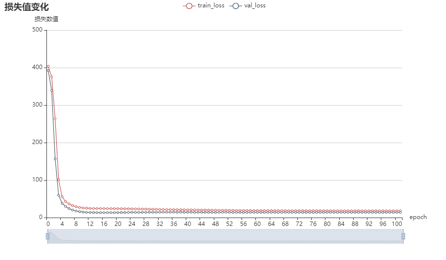

# LSTM_timeseries LSTM时间序列预测
LSTM 对 数值型时间序列 进行建模预测，并附带详细完整的注释。

- 使用LSTM神经网络进行时间序列数据建模预测。  
- 基于Tensorflow框架实现LSTM，也提供了CNN+LSTM、RNN、BP网络的实现。 
- 包含数据清洗，数据特征提取，数据建模，数据预测，可进行在线预测（即迭代预测）。  

## 一、本项目仓库 介绍
- 本仓库实现单变量预测。（多变量预测添加和改变维度即可）
- 本仓库可实现在线 循环迭代训练和预测。
- 本仓库可训练多个模型的对比（需要去把Univariate_prediction.py 文件的train_model函数的LSTM模型部分注释掉然后去掉新模型的注释即可）。

## 二、LSTM 时间序列建模预测要点
- 标准化
- 归一化
- 提前预测、延迟预测、差分 以消除滞后性影响
- 保存模型并加载
- 生成未来的时间点并预测未来，而不是预测当前的数据集。
- 案例

## 三、环境搭建
- 利用tf2_cpu.yaml并使用conda命令进行创建和安装环境。
```
conda env create -f tf2_cpu.yaml.yaml
```
- 使用pip安装
```
pip install -r requirements.txt
```

## 四、快速使用

### 1.part模式
part模式不会涉及到对未来的预测，仅仅是在当前数据集上进行划分数据集并建模预测和评估。


### 2.full模式
full模式是对当前一整个数据集进行建模，并进行评估，但是不会产生对未来的预测。


### 3.predict模式
predict模式是在full模式训练出模式之后，使用full模式训练出的模型未来进行预测。

### 4.关于项目配置 
对整个项目的配置包括模型配置，位于Univariate_prediction.py的parameter_initialization()函数中。

## 五、调参策略

### 1.主要调参变量
- windows_size
- dropout
- units1
- units2
